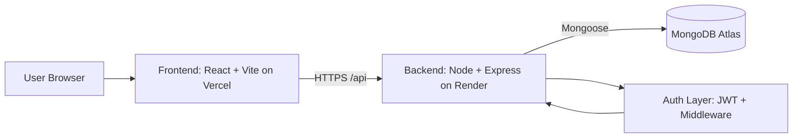
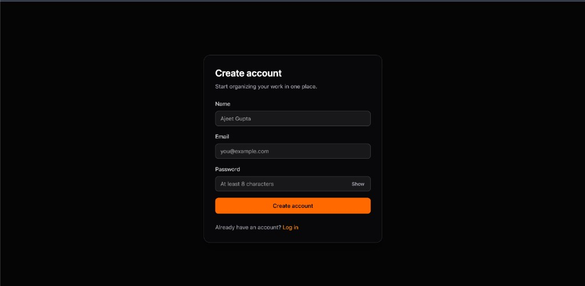
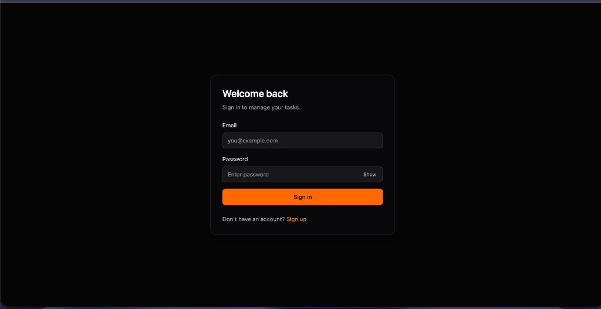

# Task Manager (MERN)

A production-oriented full-stack task management app built with a clean architecture, modern UI, and deployment-ready configuration.

It includes secure authentication, user-scoped task management, polished UX patterns, and separate backend/frontend deployments (Render + Vercel).

## Project Overview

This project is a recruiter-friendly MERN implementation focused on:

- scalable backend structure (MVC + service layer)
- secure auth (JWT + hashed passwords)
- responsive frontend with modern SaaS-style UI
- clean API integration and deployment setup

## Features

- User authentication
  - Signup and login with JWT token issuance
  - Password hashing using bcrypt
  - Protected routes for authenticated users only
- Task management
  - Create, list, update, and delete tasks
  - Task status (`pending` / `completed`)
  - User-specific task isolation
- Polished UI/UX
  - Dark theme with orange accent
  - Toast notifications
  - Loading states and empty states
  - Smooth hover transitions and responsive layout
- Production readiness
  - CORS and environment-based config
  - Render config for backend
  - Vercel config for frontend

## Tech Stack

### Backend

- Node.js
- Express.js
- MongoDB + Mongoose
- JWT (`jsonwebtoken`)
- Validation (`express-validator`)
- CORS, dotenv, bcryptjs

### Frontend

- React (Vite)
- Tailwind CSS
- React Router
- Axios
- React Hot Toast

## Folder Structure

```bash
Task-Manager/
├── client/                 # React frontend (Vite + Tailwind)
├── config/                 # env, db, cors config
├── controllers/            # request handlers
├── middleware/             # auth, error handling, validation
├── models/                 # mongoose schemas
├── routes/                 # API routes
├── services/               # backend business logic
├── server/                 # express app setup
├── render.yaml             # Render deployment config
└── server.js               # backend entrypoint
```

## Architecture Diagram



## Live Demo

- Frontend (Vercel): `https://your-frontend-url.vercel.app`
- Backend (Render): `https://your-backend-url.onrender.com/api`

> Replace the URLs above with your deployed links.

## Setup Instructions

### 1) Clone and install

```bash
git clone <your-repo-url>
cd Task-Manager
npm install
cd client && npm install
```

### 2) Configure environment variables

Create backend env file:

```bash
cp .env.example .env
```

Create frontend env file:

```bash
cp client/.env.example client/.env
```

Update values:

- Backend `.env`
  - `MONGODB_URI`
  - `JWT_SECRET`
  - `JWT_EXPIRES_IN`
  - `CORS_ORIGINS`
- Frontend `client/.env`
  - `VITE_API_URL`

### 3) Run locally

Backend:

```bash
npm run dev
```

Frontend:

```bash
cd client
npm run dev
```

## Deployment

- Backend: Render (`render.yaml` included)
- Frontend: Vercel (`client/vercel.json` included)

Detailed deployment steps are documented in `DEPLOYMENT.md`.

## Screenshots (Optional)

Add UI screenshots in a `screenshots/` folder and reference them here:

```md


```

## Author

Built by Ajeet Gupta as a full-stack portfolio project.
